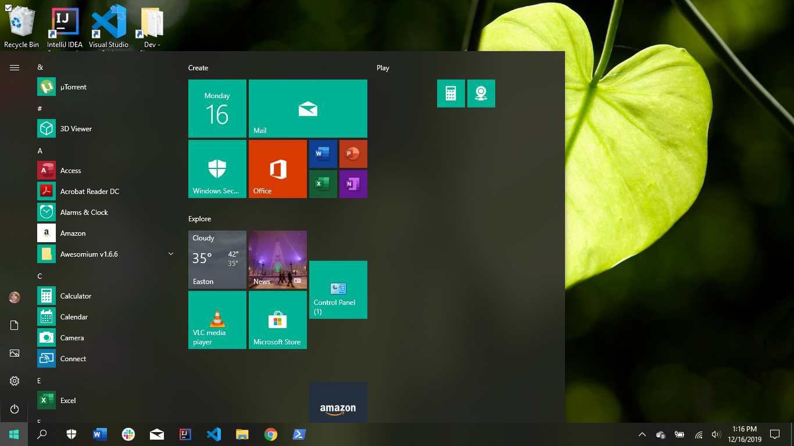

# Basic Computer Navigation

-
-
## Start Up
* When a computer is powered on, it goes through a "boot-up" process. The computer powers different components of the computer such as the
hardisks, motherboard, processors, etc. The OS or operating system is booted as well.
* Once the computer is fully booted, it may ask you to login depending on the security on the computer and then show the Desktop.

-
-

## Desktop
* The desktop is the main working space on your computer screen. It is where the icons for the files and folders on your
hard drive is displayed. You can also open windows on your desktop and browse the directories on your computer.

-
-

## Opening a Program
* You can access programs many ways on a computer. Most common ways to access a program are to click them if their icon is on the desktop
or by clicking the Window's button and getting a list of all programs and applications.
  

-

* Programs and applications can also be accessed from the Taskbar on the Desktop.

-
-
### Topic 1
* Sub-topic 1A
* Sub-topic 1B
* Sub-topic 1C

-
#### Sub-topic 1A
* Discussion point 1A.1
* Discussion point 1A.2
* Discussion point 1A.3

-
#### Sub-topic 1B
* Discussion point 1B.1
* Discussion point 1B.2
* Discussion point 1B.3

-
#### Sub-topic 1C
* Discussion point 1C.1
* Discussion point 1C.2
* Discussion point 1C.3

-
-
### Topic 2
* Sub-topic 2A
* Sub-topic 2B
* Sub-topic 2C

-
#### Sub-topic 2A
* Discussion point 2A.1
* Discussion point 2A.2
* Discussion point 2A.3

-
#### Sub-topic 2B
* Discussion point 2B.1
* Discussion point 2B.2
* Discussion point 2B.3

-
#### Sub-topic 2C
* Discussion point 2C.1
* Discussion point 2C.2
* Discussion point 2C.3

-
-
### Topic 3
* Sub-topic 3A
* Sub-topic 3B
* Sub-topic 3C

-
#### Sub-topic 3A
* Discussion point 3A.1
* Discussion point 3A.2
* Discussion point 3A.3

-
#### Sub-topic 3B
* Discussion point 3B.1
* Discussion point 3B.2
* Discussion point 3B.3

-
#### Sub-topic 3C
* Discussion point 3C.1
* Discussion point 3C.2
* Discussion point 3C.3

-
-
## Lecture Summary
* Topic 1 Summary
* Topic 2 Summary
* Topic 3 Summary
