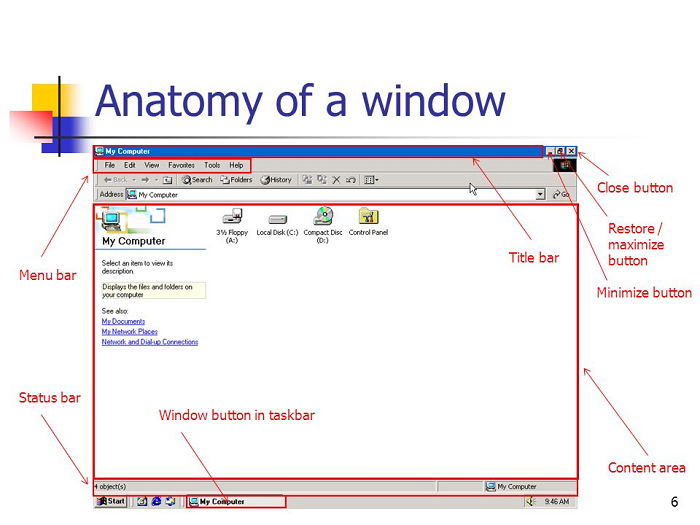

# Basic Computer Navigation

-
-
## Mouse Basics
* Left Button is the most used button. It is used to move the cursor and select items.
  * Single Click- used to select items on the screen
  * Double Click- Two clicks in rapid succession. Used to open programs
  * Click & Drag - Click and hold the cursor on the item and while holding, move the item to the desired location. Release once the item is placed.
* Right Button is used to bring up a special menu which allows you to cut, copy, paste, more.
* Scroll Wheel is used to scroll up and down a page or menu.

-

### Mouse Anatomy

-
-
## Start Up
* When a computer is powered on, it goes through a "boot-up" process. The computer powers different components of the computer such as the
CPU, motherboard, processors, etc. The OS or operating system is booted as well.
* Once the computer is fully booted, it may ask you to login depending on the security on the computer and then show the Desktop.

-
-

## Desktop
* The desktop is the main working space on your computer screen. It is where the icons for the files and folders on your
hard drive is displayed. You can also open windows on your desktop and browse the directories on your computer.

-
-

## Opening a Program
* You can access programs many ways on a computer. Most common ways to access a program are to click them if their icon is on the desktop
or by clicking the Window's button and getting a list of all programs and applications.
  

-

* Programs and applications can also be accessed from the Taskbar on the Desktop.

-

## Anatomy of a Window
* When you open a program a "window" appears. There are parts of a window that perform different tasks. Below is an image of a window and its parts.

