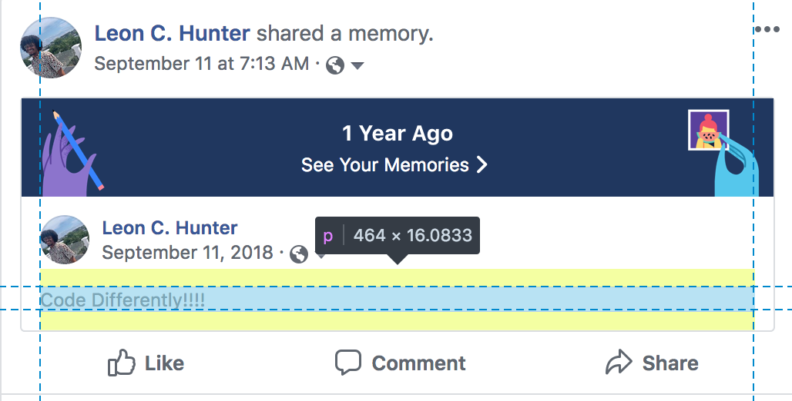

# Did you know

-
-
## Inspecting the DOM Code
* Did you know that a _browser_ allows you to use the _internet_?
* Examples of browsers are:
<table>
	<tr>
		<td>
			Chrome
		</td>
		<td>
			
		</td>
	</tr>
	<tr>
		<td>
			Firefox
		</td>
		<td>
			
		</td>
	</tr>
		<td>
			Safari
		</td>
		<td>
			
		</td>
	</tr>
</table>

-
### Document Object
* Browsers display a _document object_ to the user.
* The _document object_ can be viewed by right-clicking the page and selecting _inspect element_

-
### Inspector Tool for Inspection
#### DOM PreEdit
* The _inspector tool_ allows user to view details about how the webpage is written.

-
### Inspector Tool for Inspection
#### View Pre-Edit

-
### Inspector Tool for Editing
### DOM Post-Edit
* The _inspector tool_ also allows users to make edits directly to the DOM.

-
### Inspector Tool for Editing
### View Post-Edit
