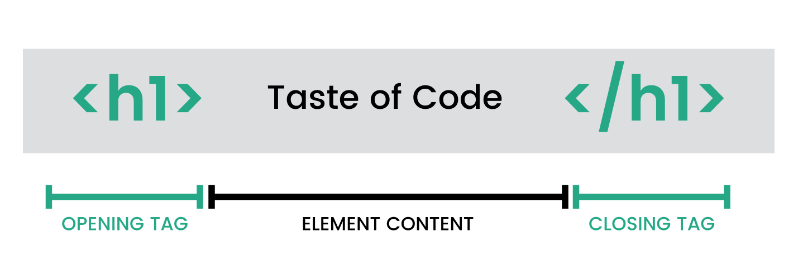

# Anatomy of HTML Tags

-
-
## HTML tags are made of few basic components
* Angle Brackets
* Names
* Attributes
* Attribute values
* Opening and Closing tags

-
-
### Angle Brackets
* (the greater than & less than symbols “<” & “>”) The  “<>” tells the web browser that “this is an html tag.”

-
-
### Names
* The name of the tag that is usually an abbreviation of a word or phrase that says what it does.
* For example `
` is an abbreviation for paragraph

-
-
### Attributes
* Attributes are specific to tags and add additional information telling the browser what to do in the context of that tag.

-
#### Attribute Values
* Very specific information for a tag attribute
* Should always be enclosed in double quotes or single quotes

-
##### Example
* 
 paragraph will be red because of the attribute and value we gave it 

* `
`

-
-

### Opening and Closing Tags
* All elements have as opening tag with the same name of the element at the beginning.
* Attributes and their value are added in the opening tag.
* The content that follows the opening tag is the child of the element.
* The closing tag has the name of the element with a forward slash before it.

-
#####Example

-
#### Self-Closing Tags
* Some elements do not contain content or children and do not need a closing tag.
* `` tags do not have a closing tag.
