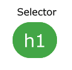
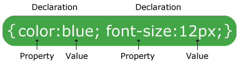
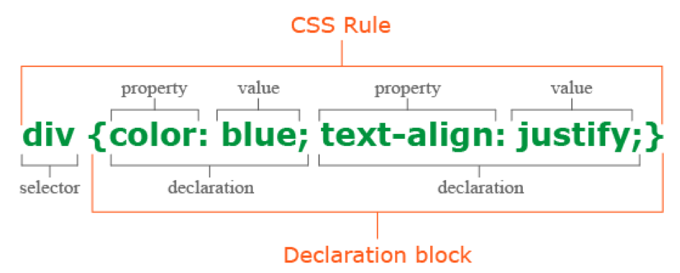

# Anatomy of CSS

-
-
### Basic Components
* Selectors
* Curly Brackets
* Properties and Values
-
-
#### Selector
* The selector points to the HTML element you want to style
* The image below shows `<h1>` as the selector.
* What element in HTML will be styled?

-
-
#### Curly Braces
* The curly braces and everything inside is a declaration block.
* There can be many declarations inside of a declaration block.
-
-
#### Properties and Values
* A single declaration includes a CSS property name and value separated by an colon
* CSS declarations always end with a semicolon.

-
-
### Example

