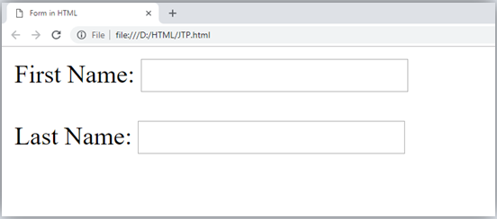
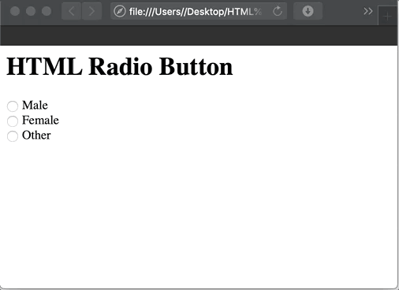
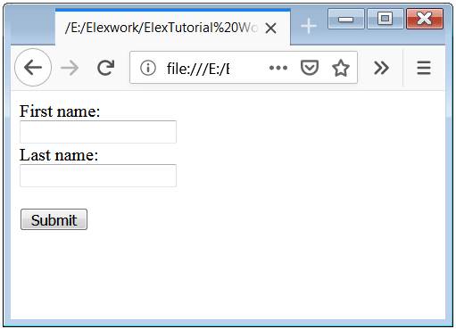

# Working with Basic Form Elements


-
-
## Lecture Overview
* HTML forms are used to collect information from the user
* An HTML form contains different types of input elements.
* Use

```HTML
  <body>
    <form> </form>
  </body>
```


-
-
### The `<input>` Element
* Input elements is the most important form element and be displayed in several ways depending on the type attribute.
    * Text Input
    * Radio Button input
    * Submit Button


-
#### Text Input
* `<input type = "text">`
* Specifies a one-line input field for text input

```HTML
  <form>
    First name:
      <br>
        <input type="text"name="firstname">
      <br>
    Last name:
      <br>
        <input type="text" name="lastname">
  </form>
```


-
#### Example



-
#### Radio Button Input
* `<input type="radio">`
* Radio buttons let a user select 1 of a certain number of choices

```HTML
  <form>
    <input type="radio" name="gender" value="female" checked> Female<br>
    <input type="radio" name="gender" value="male">
    Male<br>
    <input type="radio" name="gender" value="other"> Other
</form>
```


-
#### Example




-
#### Submit Button
* `<input type="submit">`
* Defines a button for submitting form data to a form-handler
* Form-handler is usually a server page with a script for processing input data
* The form-handler is specified in the form's "action" attribute

```HTML
<form action="/action_page.php">
  First name:<br>
  <input type="text" name="firstname" value="Mickey"><br>
  Last name:<br>
  <input type="text" name="lastname" value="Mouse"><br><br>
  <input type="submit" value="Submit">
</form>
```


-
#### Example




-
-
### The Action Attribute
* Used to point to a webpage that will load after the user submits the form
* The form data is usually sent to a web page on the server
* If the action attribute is left out, the action is set to the current page

```HTML
  <form action="/action_page.php">
```


-
-
### The Target Attribute
* Specifies a name or a keyword that indicates where to display the response that is received after submitting the form

```HTML
<form action="/action_page.php" method="get" target="_blank">

```


-
-
## Lecture Summary
* Topic 1 Summary
* Topic 2 Summary
* Topic 3 Summary
