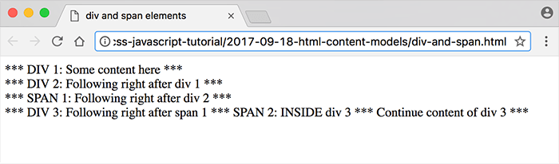

# HTML Content Models


-
-
## Content Models
Content Model refers to the set of rules that define what type of content each element is allowed to have. Mostly, this translates into what other elements are allowed to be nested inside which other elements.
* Block Level Elements
* Inline Elements


-
-
### Choosing which element to use
Each element has two main aspects that make it different from another element.
* How a browser will display it by default
* What browsers and search engines will assume about the content of that element. This is called the “semantic” value of an element.

-
-
### NON-SEMANTIC ELEMENTS
* `<div>` and `<span>` are called non-semantic elements. They don’t add any information for non-human readers. But they’re great when you only need to add styles!


-
-
### Block Level Elements
Block-level elements render (i.e., are displayed) to begin on a new line by default. (You can change that behavior with CSS but we’re not talking about CSS at this point, yet.)
* Block-level elements are allowed to wrap inline or other block-level elements.

-
#### Example of block level elements
The `<div>` tag is a block-level division or section in an HTML document. It can  contain anything, but has no semantic value.
```HTML
<div>
    <p> some content </p>
<div>  
```


-
### Inline Elements
Inline elements render on the same line by default. These elements are restricted to only contain other inline elements. It cannot wrap a
block-line element.

-
#### Example of Inline Elements
The `<span>` tag is inline division in an HTML document. It can contain any non-block content but has no semantic value.

```HTML
<p>My mother has <span style="color:brown">brown</span> eyes.</p>
```

-
-

#### Check out this code...
```HTML
<!doctype html>
<html>
<head>
  <meta charset="utf-8">
  <title>div and span elements</title>
</head>
<body>
  <div>*** DIV 1: Some content here ***</div>
  <div>*** DIV 2: Following right after div 1 ***</div>
  <span>*** SPAN 1: Following right after div 2 ***</span>
  <div>
    *** DIV 3: Following right after span 1
    <span>*** SPAN 2: INSIDE div 3 ***</span>
    Continue content of div 3 ***
  </div>
</body>
</html>
```

-


-

#### Example
```HTML
<!doctype html><html><head><meta charset="utf-8"><title>
div and span elements</title></head><body><div>*** DIV
1: Some content here ***</div><div>*** DIV 2:
Following right after div 1 ***</div><span>*** SPAN 1:
Following right after div 2 ***</span><div>*** DIV 3:
Following right after span 1 <span>*** SPAN 2: INSIDE div
3 ***</span> Continue content of div 3 ***</div></body>
</html>
```

-
### Will it be the same or different??????


-

