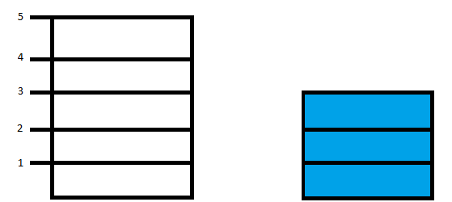

# Measuring Cups

-
-
## Setting the plot
* identify a process to measure EXACTLY 4 liters of water.
* Consider that you have the following at your dispense:
    * unlimited access to water
    * a 5-liter beaker
    * a 3-liter beaker

-
-
## Solution

-
### Step 0
* You begin with two empty beakers.
* Current state:
    * in the 5-liter beaker, precisely 0 liters of water.
    * in the 3-liter beaker, precisely 0 liters of water.
 

-
### Step 1
* The first step is to fill the 3-liter beaker to the brim.
* Current state:
    * in the 5-liter beaker, precisely 0 liters of water.
    * in the 3-liter beaker, precisely 3 liters of water.
 

-
### Step 2
* The second step is to fill the 5-liter beaker with the contents of the 3-liter beaker.
* Current state:
    * in the 5-liter beaker, precisely 3 liters of water.
    * in the 3-liter beaker, precisely 0 liters of water.
 

-
### Step 3
* The third step is to fill the 3-liter beaker to the brim.
* Current state:
    * in the 5-liter beaker, precisely 3 liters of water.
    * in the 3-liter beaker, precisely 3 liters of water.
 

-
### Step 4
* The fourth step is to fill the 5-liter beaker to the brim with the contents of the 3-liter beaker.
* Current state:
    * in the 5-liter beaker, precisely 5 liters of water.
    * in the 3-liter beaker, precisely 1 liters of water.
 

-
### Step 5
* The fifth step is to empty the 5-liter beaker.
* Current state:
    * in the 5-liter beaker, precisely 0 liters of water.
    * in the 3-liter beaker, precisely 1 liters of water.
 

-
### Step 6
* The sixth step is to fill the 5-liter beaker with the contents of the 3-liter beaker
* Current state:
    * in the 5-liter beaker, precisely 1 liters of water.
    * in the 3-liter beaker, precisely 0 liters of water.
 

-
### Step 7
* The seventh step is to fill the 3-liter beaker to the brim.
* Current state:
    * in the 5-liter beaker, precisely 1 liters of water.
    * in the 3-liter beaker, precisely 3 liters of water.
 

-
### Step 8
* The eighth step is to fill the 5-liter beaker with the contents of the 3-liter beaker.
* Current state:
    * in the 5-liter beaker, precisely 4 liters of water.
    * in the 3-liter beaker, precisely 0 liters of water.
 