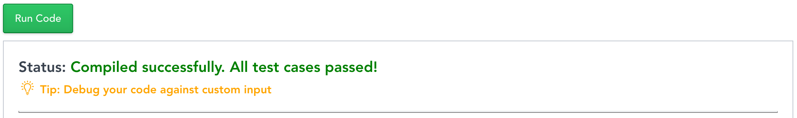

# Hackerrank
## How to Create a Test

-
-
## Logging In
* Begin by clicking [here](https://www.hackerrank.com/work/tests) or navigating to the link below:
   * `hackerrank.com/work/tests/`

 

-
## Creating a Test
* Click on the `Create Test` button located at the top right of the page.
 

-
## Select a role
* From the drop down menu, select the appropriate role that the candidate, interviewee, or trainee, is being tested on.
 

-
### Test Origin
* Select the `Build your test from scratch` radio button
 

-
## Creating a Test
* Click on the `Create Test` button located at the bottom of the window.
 

-
## Create Question
* From the `Questions` dashboard, select `Create Question` to ensure that the project is created as a langauge agnostic assessment
 

-
## Question type
* Select `Coding` from the `Select Question Type` window
 

-
## Problem statement
* Define the problem statement
 

-
## Allowed Languages
* Select which languages the project can be solved with
 

-
## Method Stub
* Create a method stub
 

-
## Generate Code
* Click the `Generate Code` button
 

-
## Verify Generated Code
* Ensure that the code generated reflects the intent of the test.
 

-
## Test Cases
* Click `Add Test Case` button
 

-
## Add Test Cases
* From the `Add Test Case` window, insert input and respective output values.
* Ensure at least 2 cases are `Marked as Sample Case`.
 

-
## Review Test Cases
* Review each test case
 

-
## Quality Review
* Ensure that quality review does not indicate any major warnings or errors with the project.
 

-
## Solve
* Attempt problem to ensure bugs are ironed
 

-
## Verify Validity
* Ensure all test cases pass
 

