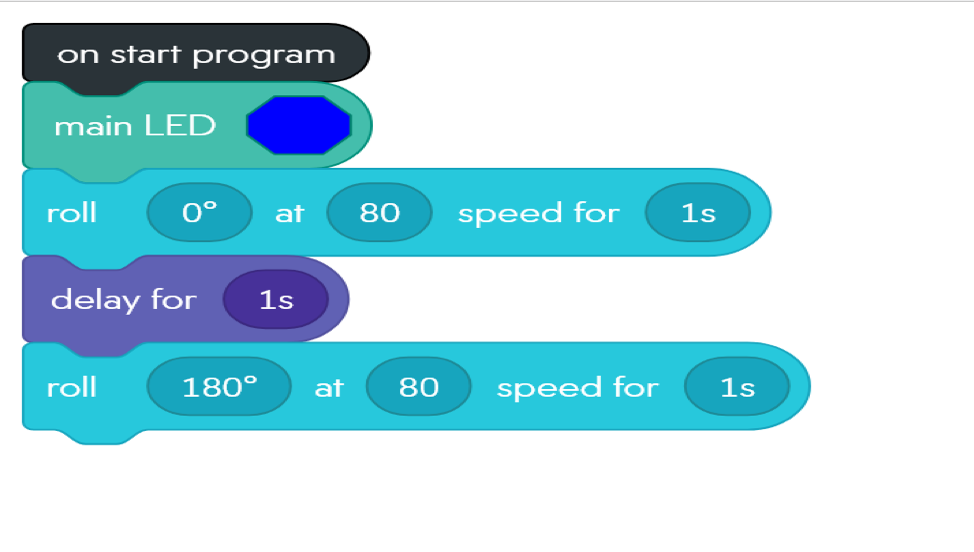
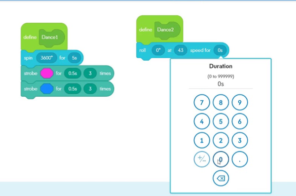
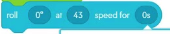

# Block Programming

-
-

### Do you remember???
* Do you remember looking at our daily lives in blocks?

-
-

### What is a block??

 A block is a group of declarations and statements in source code structure.

-
-

#### What is a function???

 A function is a collection of statements that are grouped together to perform an operation

-
-

#### What is a statement???

 A statement is a single line of code to perform a specific task

-
-

#### Circles and Degrees
* Discussion point 1C.1
* Discussion point 1C.2
* Discussion point 1C.3

-
-
### Topic 2
* Sub-topic 2A
* Sub-topic 2B
* Sub-topic 2C

-
#### Sub-topic 2A
* Discussion point 2A.1
* Discussion point 2A.2
* Discussion point 2A.3

-
#### Sub-topic 2B
* Discussion point 2B.1
* Discussion point 2B.2
* Discussion point 2B.3

-
#### Sub-topic 2C
* Discussion point 2C.1
* Discussion point 2C.2
* Discussion point 2C.3

-
-
### Topic 3
* Sub-topic 3A
* Sub-topic 3B
* Sub-topic 3C

-
#### Sub-topic 3A
* Discussion point 3A.1
* Discussion point 3A.2
* Discussion point 3A.3

-
#### Sub-topic 3B
* Discussion point 3B.1
* Discussion point 3B.2
* Discussion point 3B.3

-
#### Sub-topic 3C
* Discussion point 3C.1
* Discussion point 3C.2
* Discussion point 3C.3

-
-
## Lecture Summary
* Topic 1 Summary
* Topic 2 Summary
* Topic 3 Summary
