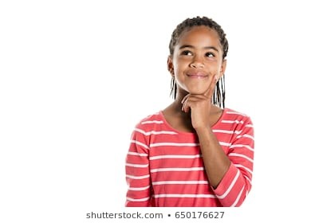

# Digital Citizenship

-
-
## Lecture Overview
* What makes a good Digital Citizen?
* Digital Footprint
* Media Balance
* Privacy & Security
* Communication
* Cyberbullying

-
-
### What makes a good digital citizen?
* Safety
* Responsibility
* Respectful

-
#### Safety
* Always ask a parent or a teacher first before going online.
* Visit the "green" websites and avoid the "red" websites.
* Only talk to people you know.
* Never share important information online.

-
#### Responsibility
* Discuss with a parent or teacher what you would like to do on the internet
* Tell an adult if something on the internet makes you feel scared or nervous.
* Follow all rules your parent or adult gives you while online

-
#### Be Respectful
* Be kind when online
* Stand up for others who may be bullied
* Ask before sharing a friends post online

-
-
### Digital Footprint
* What is OK to share online
* What is not OK to share online

-
#### What is OK to Share
* Share your hobbies
* Share about the things you like
* Share your favorite things

-
#### What is Not OK to Share
* Your full name and birthday
* Phone number and home address
* Your school

-
-
### Media Balance
* When to take a break
* Inviting a friend to play when they are alone
* Turning off your device before going to bed

-
#### When to take a break from your device
* Take a break when talking to people in person
* Take time to get away after using a device for a certain amount of time
* If your device is not being used for schoolwork, put it away until finished homework

-
#### Activities to do without a device
* Enjoying a playground
* Reading a book
* Helping a parent or guardian cook a meal
* Build a Lego city

#### Your perfect day with Media
* Think about the amount of time you spend each day on a device
* How much time do you spend in the morning, afternoon, evening, and at night before bed
* Do you think that there is a good balance in your life?

#### Activity
* Think about what daily tasks you do in a 24 hour period
* From the time you wake up to going to bed, what does your day look like?
* There are 24 blocks. Each block represents 1 hour. Write in each block an activity or task.

-
-
###

-
-
## Lecture Summary
* Topic 1 Summary
* Topic 2 Summary
* Topic 3 Summary
