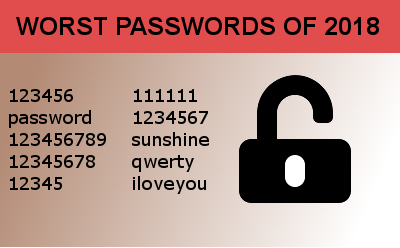

# Digital Citizenship

-
-
## Lecture Overview
* What makes a good Digital Citizen?
* Digital Footprint
* Media Balance
* Privacy & Security
* Communication
* Cyberbullying

-
-
### What makes a good digital citizen?
* Be safe
* Be responsible
* Be respectful

-
#### Be Safe
* Always ask a parent or a teacher first before going online.
* Visit the "green" websites and avoid the "red" websites.
* Only talk to people you know.
* Never share important information online.

-
#### Be Responsible
* Discuss with a parent or teacher what you would like to do on the internet
* Tell an adult if something on the internet makes you feel scared or nervous.
* Follow all rules your parent or adult gives you while online

-
#### Be Respectful
* Be kind when online
* Stand up for others who may be bullied
* Ask before sharing a friends post online

-
-
### Digital Footprint
* What is OK to share online
* What is not OK to share online
* What information is being recorded online every time you visit a website

-
#### What is OK to Share
* Share your hobbies
* Share about the things you like
* Share your favorite things

-
#### What is Not OK to Share
* Your full name and birthday
* Phone number and home address
* Your school

-
* What fields on this entry form should be shared online?

-
#### What is recorded?
* What search engine do you use?
* Everything that we do online is being recorded and can never be erased.
* Always be aware of what you post and search for online.

-
-
### Media Balance
* When to take a break from your device
* How much time should you spend on your device?
* Know when to turn off your device

-
#### When to take a break from your device
* Take a break when talking to someone face to face
* Put your device away when eating with family and friends
* If your device is not being used for schoolwork, put it away until finished homework

-
#### Activities to do without a device
* Play outside
* Read a book or comics
* Helping a parent or guardian prepare a meal
* Playing an instrument

-

#### Your perfect day with Media
* Think about the amount of time you spend each day on a device
* How much time do you spend in the morning, afternoon, evening, and at night before bed?
* Do you think that there is a good balance in your life?

-
#### Activity
* Think about what daily tasks you do in a 24 hour period
* From the time you wake up to going to bed, what does your day look like?
* There are 24 blocks. Each block represents 1 hour. Write in each block an activity or task.

-
-
### Passwords
* What is a password?
* What makes a strong password?
* The importance of having more than one password.

-
#### What is a password?
* A secret string of letters, symbols, and numbers that you can use to prevent others From
accessing your information digitally.

-
#### What makes a bad password?
* Using common words or names
* Repeated letters or common patterns
* Using words from a dictionary
* Using private information such as a birthdate or address

-
#### What makes a strong password?
* A mixture of lowercase and uppercase letters
* Using random numbers
* Adding in symbols. Example: !@#$%^&*
* Making sure the password is at least 8 characters long.

-

-
#### Having more than one password
* Ensures if one account is hacked, other accounts cannot be breached
* Decreases the chance that your password will be discovered

-
-
### Private and Personal Information
* Why do people share information about themselves
* The difference of private and personal information
* The risks of sharing private information

-
#### Why do people share?
* Our brains are wired to share with other people
* People like to help and entertain other while online
* To build or maintain a relationship with someone or a group of people

-
#### Private Information
* Private information can be used online to identify you because the information
is unique to you.

-
#### Personal Information
* Personal information cannot be used to identify you because it can be true for other people as well.

-
#### Risks of Sharing Private Information
* Anyone can know your location and cause harm
* Hackers and criminals can use your information to steal your identity

-
-
### Cyberbullying
* What is Cyberbullying?
* The Power of Words
* How to respond to Cyberbullying

-
-

#### What is Cyberbullying?
* The use of electronic communication to bully a person,  by sending messages of an intimidating or threatening nature.

-

#### The Power of Words
* Words can be interpreted differently by different people. It is important to think about the words we use and how they affect people.
We might say something to be funny, but someone may take it seriously, and it may hurt their feelings. Remember, your communication with
your family and friends will not be the same with other people.

-

#### Same Phrase, Different Tone
* Imagine someone yelling in an angry tone, "Have a nice day!!!". How would that make you feel?

-

#### Same Phrase, Different Tone
* Now imagine someone saying the same phrase but with a pleasant tone and a smile. How would that make you feel?

-

#### How to respond to Cyberbullying
* What are some ways to respond to cyberbullying?

-

#### Do not respond
* A cyberbully's intention is not only to hurt another person's feelings but to also get a response.
* Refusing to respond to a cyberbully allows you to uphold yourself to a higher standard than them.
* In most situations, a cyberbully that does not receive a response will more than likely stop the bullying.
* Logging off the website, app, or game at the moment of cyberbullying may help as well.

-
#### Block the Cyberbully
* Blocking the cyberbully is one way to prevent the person from sending you messages in the future.

-
#### Tell an Adult
* There are cyberbullies that will continually bully someone even if the previous steps are followed.
* If you encounter a cyberbully that does not stop, it is important to tell an adult you trust for assistance.
* You do not have to fight the cyberbully alone. Get an adult you trust!

-
#### Save the Evidence
* In certain cases where the cyberbullying is severe and requires more action than blocking the bully, you may have to save the evidence.
* Taking a screenshot of the conversation between you and the bully will help an adult investigate or share the information with someone
that can help.

-
#### Standing up for others
* When online, you may witness someone else being cyberbullied. What should you do?
* Pause and think about the situation. Sending a positive response to the person being cyberbullied can give them strength
and help them to feel better.
* Share with the person the step they should take to end the cyberbullying.
* If the cyberbullying is too severe, immediately go to an adult you trust for assistance. 

-
-
## Lecture Summary
* Topic 1 Summary
* Topic 2 Summary
* Topic 3 Summary
